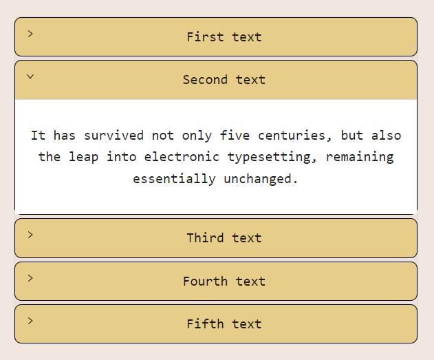

# Accordion App

This project contains an Accordion App.
Rules for launching the application correctly are in the file "Documentation.docx"

## Available Scripts

In the project directory, you need to run:

### `npm install`
Installs npm in project.

### `npm start`

Runs the app in the development mode.\
Open [http://localhost:3000](http://localhost:3000) to view it in your browser.

### `npm test`

Launches the test runner in the interactive watch mode.\
See the section about [running tests](https://facebook.github.io/create-react-app/docs/running-tests) for more information.

This project was bootstrapped with [Create React App](https://github.com/facebook/create-react-app).
